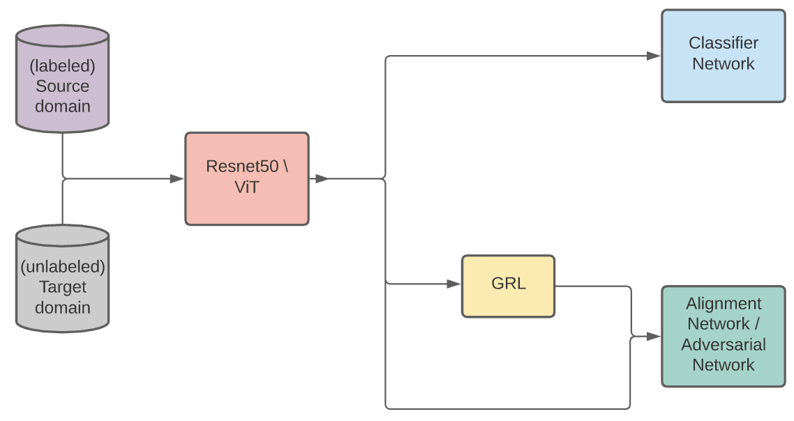

# Unsupervised domaina adaptation for image classification #

This repository containes different SOTA unsupervised domain adaptation implementations in pytorch lightning.

# Implemented papers

Paper: Deep CORAL: Correlation Alignment for Deep Domain Adaptation (DEEP_CORAL) 

link: https://arxiv.org/abs/1607.01719

-------------

Paper: Unsupervised Domain Adaptation by Backpropagation, Ganin & Lemptsky (2014) (DANN)

link: https://arxiv.org/abs/1409.7495

-------------

Paper: Adversarial Discriminative Domain Adaptation, Tzeng et al. (2017) (ADDA)

link: https://arxiv.org/abs/1702.05464

-------------

Paper: Conditional Adversarial Domain Adaptation (CDAN)

link: https://arxiv.org/abs/1705.10667

-------------

# Description
All models implemented work at features level, in other words, they all use a backbone to extract features from the input data and a classifier network to correctly classy the source domain. 

Next, depending on the unsupervised domain adaptation method the alignment network, the adversarial network as well as the gradient reversal layer are used.



Depending  on  the  chosen  block  different  models  can  be  imple-mented.


During training, the downstream task, as well as unsupervised domain adap-tation, are performed. 

As a result, the feature extractor (backbone) and the Classifier Network can be used at testing time to make inference on the unlabelled target domain 


# Setup

To completely install the requirements run:

* `pip install -U -r requirements.txt`

# How to run
After setting the right configuration in ```./conf/config.yaml``` run:

* `python main.py`

During training one can inspect the model behaviour with tensorboard using the following command:

* `tensorboard --logdir ./logs`
